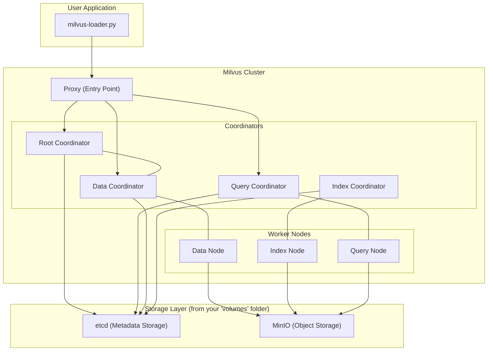
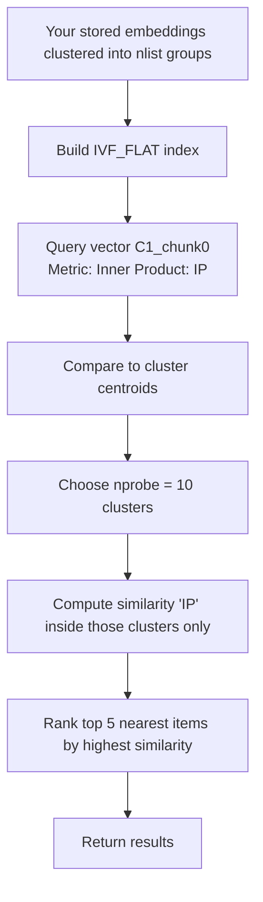

# Legal Document Analyzer
## Introduction

For this project, it is intended to create embeddings of casedocs and statutes provided in the AILA challenge so that they are stored with milvus and the developed RAG can make consultations on the data that is more similar whithin each other to obtain an appropiate response. In said challenge we ought to optimize this Retrieval-Augmented Generation system until the responses obtained matched the desired results.

Moreover, some simple tests are already implemented to test the similaries between a query(in this case one of the chunks of a document) and the database.

## Relevant Concepts

-Cluster
-Centroid

## Table of Contents
- [Installation](#installation)
- [Usage](#usage)
- [Preprocessing](#preprocessing)
- [Data Dumping](#data-dumping)
- [Testing](#testing)
- [Functions](#utility-and-data-handling-functions)
- [License](#license)

## Installation

1. Clone the repository:
  ```sh
  git clone https://github.com/javiergarciasantana/AILA-Challenge.git
  ```
2. Navigate to the project directory:
  ```sh
  cd AILA-Challenge
  ```
3. Create a virtual environment and activate it:
  ```sh
  python -m venv .venv
  source .venv/bin/activate   # on macOS/Linux
  ```
4. Install the required libraries
  ```sh
  pip install -r requirements.txt
  ```
5. Install Docker locally in your machine:
  ```sh
  sudo apt-get install docker-ce docker-ce-cli containerd.io docker-buildx-plugin docker-compose-plugin
  ```
6. Using `docker-compose.yml`run:
  ```sh
  docker compose up -d
  ```

7. To check if the container is running use:

  ```sh
  docker ps
  ```
8. Now you can test its connection by creating a new file and running:
    ```python
    connections.connect("default", host="localhost", port="19530")
    print("Succesfully connected to milvus container!")
    ````

## Usage

1. Ensure you have the required files in the appropriate directories:
  - `./archive/Object_casedocs`
  - `./archive/Object_statutes`
  - `./archive/Query_doc.txt`
  - `./archive/relevance_judgments_priorcases.txt`
  - `./archive/relevance_judgments_statutes.txt`
2. To preprocess the data simply run `preprocessing.py``

  ```sh
  python3 preprocessing.py
  ```
3. And to load the data/run the tests:

  ```sh
  python3 milvus-loader.py
  ```

## Docker arquitecture


Milvus Cluster: The core of the vector database, composed of several microservices that can be scaled independently.

* Proxy: The public-facing entry point of the cluster. It receives all requests from your script, validates them, and routes them to the appropriate internal components.
* Coordinators: The "brain" of the cluster, managing different aspects of the system.
* Root Coordinator: Handles data definition tasks, such as creating or deleting collections and partitions.
* Data Coordinator: Manages data manipulation, like insertions and deletions, and ensures data is flushed from memory to persistent storage.
* Query Coordinator: Manages query tasks by distributing them to the Query Nodes for execution.
* Index Coordinator: Manages the creation and maintenance of vector indexes.
* Worker Nodes: The "muscle" of the cluster, performing the actual data processing and searching.
* Data Node: Ingests and stores incoming vector data.
* Index Node: Builds the vector indexes on the data segments to accelerate searches.
* Query Node: Loads data segments and their indexes into memory to perform searches and queries.
* Storage Layer: The persistent backend for Milvus, represented by your volumes directory.

* etcd: A distributed key-value store used to save all metadata for the Milvus cluster. This includes collection schemas, index definitions, and the state of data segments. Your etcd directory contains its data files.
* MinIO: An S3-compatible object storage service. Milvus uses it to store the actual raw data, including the vector embeddings and their index files. Your minio directory contains this data.

## Preprocessing data
  Firsly, we need to so some preprocessing, hence the file `preprocessing.py`.
  Here we simply get the casedocs and statutes from the archive dir with the func `load_docs()`. Then we need to crea a list of dictionaries to store our data properly. We first append the casedocs and then the statutes. This way we prepair it for chunking. This means we split each doc in smaller pieces so that the embedding can be done well. 

  ```python
  text_splitter = RecursiveCharacterTextSplitter(chunk_size=1000, chunk_overlap=100)
chunked_docs = []
for doc in docs:
    chunks = text_splitter.split_text(doc["text"])
    for i, chunk in enumerate(chunks):
        chunked_docs.append({
            "text": chunk,
            "type": doc["type"],
            "id": f"{doc['id']}_chunk{i}"
        })
  ```
  Here we simply use the `RecursiveCharacterTextSplitter` Class func to split the docs. 
  does not guarantee exactly 1000 characters per chunk.

  It tries to:

  * Respect natural language boundaries — like paragraphs, sentences, or words.

  * Avoid breaking tokens mid-word or mid-sentence.

  * Stay close to 1000 characters, but will make chunks shorter if splitting nicely requires it.

  For instance, if a paragraph ends at 850 characters, the splitter will start a new chunk rather than slicing through the sentence to reach 1000.
    
  ---
  Another thing that we need to keep track of is which part corresponds to what, meaning we need to know what document exactly and what chunk of that document was used to obtain a response. Therefore we add what we call metadata, each divided part is a `chunk`, has a `type`(casedoc or statute) and an `id`(the casedoc or statute number).

  Now with the list of docs, we will embed each element of the list, which simply means we will assign a high-dimendional value(vector) to all the chunks, the parts that refer to similar information, will point to a similar direction, we know this when we obtain the inner product of the query vector and each of the ones that we are compairing it to.

  For this, another Class is used `SentenceTransformer`, instead of building an embedding to save some time. If they were to be tuned for our specific domain, a model could be built.

  ```python
    model = SentenceTransformer("sentence-transformers/all-MiniLM-L6-v2")

    def embed_text(texts):
        return model.encode(texts, 
        batch_size=64, 
        show_progress_bar=True, 
        convert_to_numpy=True)

    texts = [d["text"] for d in chunked_docs]
    embeddings = embed_text(texts)
  ```

  After this, the embeddings are stored in 2 `.tsv` for visualization and further use when loading into milvus db.

  ```python
    def save_embeddings(embeddings, chunked_docs):
      try:
  
          # 1. Save embeddings as a TSV file
          np.savetxt("export/embeddings.tsv", np.array(embeddings), delimiter="\t")
          print("✅ Embeddings saved successfully.")

          # 2. Save metadata (text + type + id) as TSV
          metadata_df = pd.DataFrame({
              "id": [d["id"] for d in chunked_docs],
              "type": [d["type"] for d in chunked_docs],
              "text": [d["text"][:200].replace("\n", " ") for d in chunked_docs]  # truncate for readability
          })
          metadata_df.to_csv("export/metadata.tsv", sep="\t", index=False)
          print("✅ Metadata saved successfully.")

          return True  # indicate success

      except Exception as e:
          print(f"❌ Error while saving embeddings or metadata: {e}")
          return False  # indicate failure
  ```

## Data dumping

In this step we simply load the previously generated `.tsv` files into memory with one of the helper functions, then we connect to the milvus container that we previously created. 

So that we are not loading the same data onto the container over and over, we  simply check if a collection is created and if not, we dump the data:

```python
    if not utility.has_collection("legal_docs"):
      store_data(meta_df, embeddings)
      print("Collection created and data stored.")
  else:
      print("Collection already exists, skipping data insertion.")
      collection = Collection("legal_docs")
```

When we go to the `store_data()` func, we firstly need to create a list of `FieldSchema`, one for each of the metadata:

```python

  fields = [
      FieldSchema(name="id", dtype=DataType.VARCHAR, is_primary=True, max_length=200),
      FieldSchema(name="embedding", dtype=DataType.FLOAT_VECTOR, dim=dim),  # adjust dim(embeddings.shape())
      FieldSchema(name="type", dtype=DataType.VARCHAR, max_length=20)
  ]
```

This is just to define our collection, which will be created next. take it as atributes for each element of the database. Also, worth commenting is the `dim` var wich corresponds to the with of the embeddings, so that we know how big each vector is.

As promised, next up is the collection:

```python
schema = CollectionSchema(fields, description="Legal RAG embeddings")

  # Create the collection
  collection = Collection("legal_docs", schema)
  print("Collection ", collection.name, " created")
```

Once this molded container to fit our data is created, we need to dump the data in batches not to exceed the buffer. Here we will go for `batch=500`. It is required we do that for each field:

```python

  for i in range(0, len(embeddings), batch_size):
      batch_ids = meta_df["id"][i:i+batch_size].tolist()
      batch_embeddings = embeddings[i:i+batch_size].tolist()
      batch_types = meta_df["type"][i:i+batch_size].tolist() if "type" in meta_df.columns else ["unknown"] * len(batch_ids)

      collection.insert([batch_ids, batch_embeddings, batch_types])
```
Milvus stores that data in memory first (in a write buffer). It does not immediately persist it to disk or make it visible to search queries. This is why we need to add the line `collection.flush()`.


## Testing(To be expanded soon)

### How similarity search works
As I explained earlier,  each text chunk (e.g., "C1_chunk0", "C1204_chunk0", etc.)
is represented as a vector in a high-dimensional space.

Visually, imagine each as a dot:

⬤ = a vector (e.g. a text chunk embedding)

```md

        ⬤⬤       ⬤
   ⬤⬤⬤      ⬤⬤⬤⬤⬤
         ⬤
⬤⬤      ⬤⬤⬤
```

That’s your vector space — thousands of embeddings scattered in a 384-D world (we show 2D here).

#### Step 1. IVF_FLAT creates clusters (index building)


IVF_FLAT = Inverted File with Flat vectors

When you create the index:

```python
index_params = {
    "index_type": "IVF_FLAT",
    "params": {"nlist": int(np.sqrt(num_vectors))}
}
```

Milvus divides all embeddings into nlist clusters (for example, 100 clusters).

It finds nlist centroids (think “average positions”).

Each embedding is assigned to the nearest centroid.

```pgsql
Cluster 1      Cluster 2       Cluster 3
  ⬤⬤⬤        ⬤⬤⬤          ⬤⬤⬤
   ⬤            ⬤⬤           ⬤⬤⬤
```

Why?
Because when searching, you don’t want to compare the query with every single vector.
Instead, you’ll look only inside a few relevant clusters.

#### Step 2. You query with one vector

You choose one embedding as the query:

```py
query_vector = embeddings[0].tolist()
```

That's our `C1_chunk0` vector — Milvus will find vectors with similar direction.

#### Step 3. nprobe controls how many clusters to search

You set:

`param={"nprobe": 10}`


Milvus will:

Compare your query to all cluster centroids.

Select the 10 closest clusters (out of the total nlist).

Search only within those clusters for the top matches.

```py
  results = collection.search(
    data=[query_vector],             # must be a list of vectors
    anns_field="embedding",          # the field to search
    param={"nprobe": 10},            # how many clusters to probe
    limit=5,                         # how many nearest neighbors to return
    output_fields=["id", "type"]     # extra metadata to return
  )
```


* Higher nprobe = more accurate (but slower).

* Lower nprobe = faster (but less thorough).

#### Step 4. Inner Product similarity (metric_type="IP")

For each candidate vector inside those clusters,
Milvus computes the inner product with the query vector:

 $`similarity=𝑞⋅𝑥=∥𝑞∥∥𝑥∥cos(𝜃)`$


Since most embeddings are normalized,
this is equivalent to cosine similarity (higher = more similar).

#### Step 6. Ranking and returning results

Milvus sorts all candidates by similarity score
and returns the top N (you chose limit=5). This is done firstly just to verify that the search works properly:

|Rank | ID             | Type     | Score (IP) |
|-----|----------------|----------|------------|
|1    | C1_chunk0      | casedoc  | 1.0000     |
|2    | C1204_chunk0   | casedoc  | 0.8580     |
|3    | C463_chunk0    | casedoc  | 0.8482     |
|4    | C2050_chunk0   | casedoc  | 0.8476     |
|5    | C2536_chunk0   | casedoc  | 0.8467     |

#### Conceptual flow



### Similarity test

```python

index_params = {
    "metric_type": "IP",        # inner product similarity (the higher the better)
    "index_type": "IVF_FLAT",   # a clustering index type (medium datasets)
    "params": {"nlist": int(np.sqrt(collection.num_entities))}    # number of clusters to create, good heuristic -> nlist = int(sqrt(num_vectors))
  }

  collection.create_index(field_name="embedding", index_params=index_params)
  collection.load() # loads the indexed data into memory -> ready to search
  
  query_vector = embeddings[0].tolist() # -> The embedding of C1_chunk0     
  
  # Here we just do a very simple search to test similarity
  results = collection.search(
    data=[query_vector],             # must be a list of vectors
    anns_field="embedding",          # the field to search
    param={"nprobe": 10},            # how many clusters to probe
    limit=5,                         # how many nearest neighbors to return
    output_fields=["id", "type"]     # extra metadata to return
  )
  
  print("\nTest Results\n")
  # The top-5 most semantically similar embeddings are these, with their similarity scores.
  for hit in results[0]:
    print(f"ID: {hit.id} | Score: {hit.distance:.4f}")
```
### Similarity test result(C1_chunk0 as query)

```bash
Test Results

ID: C1_chunk0 | Score: 1.0000
ID: C1204_chunk0 | Score: 0.8580
ID: C463_chunk0 | Score: 0.8482
ID: C2050_chunk0 | Score: 0.8476
ID: C2536_chunk0 | Score: 0.8467
```

## Utility and Data Handling Functions

This module provides a set of helper functions for loading, processing, and managing legal documents, queries, judgments, and embeddings.  

---

### File Reading and Parsing

- **`read_file(file_path)`**  
  Reads the content of a text file and returns it as a string.

- **`process_query_to_dict(line)`**  
  Converts a line from the queries file into a dictionary entry.  
  Each line is expected to have the format `KEY||VALUE`.

- **`process_judgment_to_dict(line, result_dict)`**  
  Parses a relevance judgment line (with 4 whitespace-separated columns) and updates the result dictionary  
  with tuples of related case or statute identifiers where relevance equals `1`.

---

### Document and Query Loading

- **`load_objects(type, folder_path)`**  
  Loads legal documents of a given type (`"casedocs"` or `"statutes"`) from a specified folder.  
  Each document is stored in a dictionary keyed by its file name (without extension).

- **`load_queries(file_path)`**  
  Reads and processes all query lines from a text file into a dictionary,  
  using `process_query_to_dict()` to handle formatting.

- **`load_judgments(file_path)`**  
  Loads and parses the relevance judgment file into a dictionary,  
  where each key corresponds to a query ID and values are lists of relevant case or statute pairs.

---

### Visualization and Export

- **`visualize_docs(docs)`**  
  Converts a list of document dictionaries into a Pandas DataFrame for inspection.  
  Displays the first 10 entries with truncated text for readability.

---

### Embedding Management

- **`save_embeddings(embeddings, chunked_docs)`**  
  Saves model-generated embeddings and their metadata into TSV files located in the `export/` directory.  
  - **`embeddings.tsv`** stores numerical vector representations.  
  - **`metadata.tsv`** stores related text snippets, types, and IDs.  
  Returns `True` if successful, otherwise prints an error and returns `False`.

- **`load_embeddings()`**  
  Loads the saved embeddings and metadata from TSV files.  
  Returns both as `(meta_df, embeddings)` and prints the shape of the embeddings for verification.

---

These functions form the foundation for the preprocessing and data management steps used in building the RAG (Retrieval-Augmented Generation) pipeline.

## References

* [AILA Database](https://www.kaggle.com/datasets/ananyapam7/legalai/data)
* [Milvus documentation page](https://milvus.io/docs/quickstart.md)
* [Milvus Collections](https://milvus.io/docs/v2.2.x/check_collection.md)
* [Setting Up Milvus container in Docker](https://www.youtube.com/watch?v=K0ZayH0n7sI)
* [Available pretrained embedding models](https://sbert.net/docs/sentence_transformer/pretrained_models.html)
* [How is the chunking done with `RecursiveCharacterTextSplitter`](http://python.langchain.com/docs/how_to/recursive_text_splitter/)
